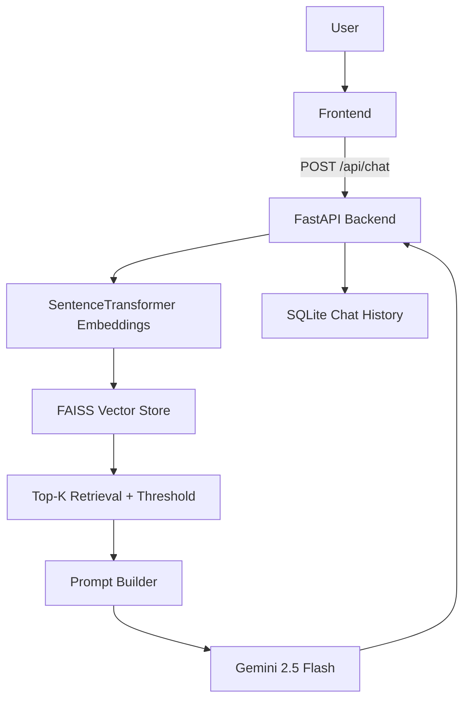

# Production-Grade GenAI Chat Assistant with RAG

## Project Overview
This project is a production-ready GenAI assistant using FastAPI, Gemini, SentenceTransformers embeddings, and FAISS retrieval. It answers user questions using context grounded in a local knowledge base (`docs.json`) and supports secure API access via JWT.

## Architecture Diagram (Mermaid)


## RAG Workflow
1. Load and chunk documents.
2. Generate embeddings with `all-MiniLM-L6-v2`.
3. Store vectors and metadata in FAISS.
4. Embed query and retrieve top-k chunks.
5. Apply threshold (`0.70`).
6. Build prompt with context + conversation history.
7. Generate grounded response via Gemini.

## Embedding Strategy
- Model: `all-MiniLM-L6-v2`
- Normalized vectors for robust semantic retrieval.

## Similarity Search
- FAISS `IndexFlatIP` for dense vector similarity.
- Top 3 chunks returned with scores.
- Safe fallback if no score exceeds threshold.

## Prompt Design
The prompt strictly instructs the model to use retrieved context and admit when the answer is unavailable.

## Installation
```bash
python -m venv venv
venv\\Scripts\\activate
pip install -r requirements.txt
```

## Environment Variables
Copy `.env.example` to `.env` and set:
- `GEMINI_API_KEY`
- `JWT_SECRET_KEY`

## Running Locally
```bash
python app.py
```
Open `http://127.0.0.1:8000`

## Render Deployment
- `render.yaml` included
- Build command: `pip install -r requirements.txt`
- Start command: `uvicorn app.main:app --host 0.0.0.0 --port $PORT`

## API Docs
Swagger: `http://127.0.0.1:8000/docs`

## Endpoints
- `GET /health`
- `POST /auth/token`
- `POST /api/chat` (JWT required)

## Screenshots Placeholders
- `docs/screenshots/chat-ui.png`
- `docs/screenshots/swagger.png`
- `docs/screenshots/deploy.png`
